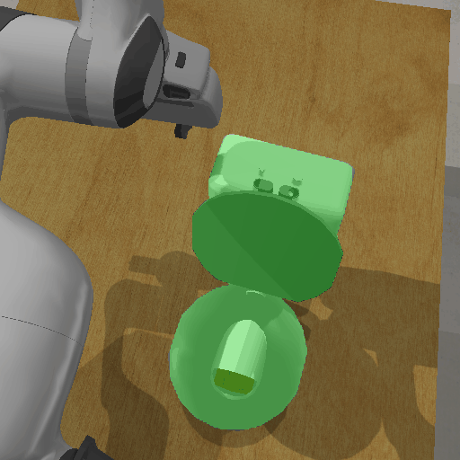
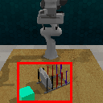

# Instant Policy: FastSAM Fork

### Contribution
Integrated FastSAM into the simulated rollout to generate segmentation masks.

We are able to succsfully rollout the 'ToiletSeatDown' task using segmentation masks obtained from FastSAM with a text prompt.

<p align="center">

</p>

In general, most rollouts failed. We initially attempted to prompt the model to generate the correct segementation via a text prompt but did not see consistent results. Increasing the resolution of the simulation cameras only improved performance marginally. We then tried using the segmentation 'hack' to create a bbox to prompt the model to generate the segementations but still saw poor performance.  

<p align="center">

</p>

The model struggles to segment the same objects consistently between frames, especially when there is occlusion due to the arm or other objects. This highlights the need for a tracking model or a more advanced segmentation model such as SAM3 that has memory and can perform tracking itself.

### Original
Code for deploying a pre-trained model on Linux machines from the paper: "Instant Policy: In-Context Imitation Learning via Graph Diffusion", 
[Project Webpage](https://www.robot-learning.uk/instant-policy)

<p align="center">

</p>

## Setup

**Clone this repo**

```
git clone https://github.com/vv19/instant_policy.git
cd instant_policy
```

**Create conda environment**

```
conda env create -f environment.yml
conda activate ip_env
pip install pyg-lib -f https://data.pyg.org/whl/torch-2.2.0+cu118.html
pip install -e .
```

For simulation deployment, install RLbench by following the instructions in https://github.com/stepjam/RLBench.

## Quick Start

### Try our model for RLBench tasks.

Download pre-trained weights.

```
./download_weights.sh
```

Download FastSAM Weights.

```
wget [https://github.com/ultralytics/assets/releases/download/v8.2.0/FastSAM-x.pt](https://github.com/ultralytics/assets/releases/download/v8.2.0/FastSAM-x.pt)
```

Run inference.

```
python deploy_sim.py \
 --task_name='plate_out' \
 --num_demos=2 \
 --num_rollouts=10
```

Try it out with different tasks, e.g. `open_box` or `toilet_seat_down`! More in `sim_utils.py`.

## Deploy on Your Robot

Every robot (and its user) uses different controllers and gets observations in different ways. In `deploy.py`, we provide examples of how to use Instant Policy for deployment on any robotic manipulator using parallel-jaw gripper.
- Collect demonstration in a form of `demo = {'pcds': [], 'T_w_es': [], 'grips': []}`, where `pcds` is a list of numpy arrays prepresenting the segmented point clouds expressed in the world frame, `T_w_es` is a list of numpy arrays (4, 4) representing poses of the gripper in the world frame and `grips` is a list of integers (0 for closed, 1 for open).
- Process the demonstrations using `sample_to_cond_demo(demo, num_traj_wp=10)`.
- Capture current observations of T_w_e, pcd_w, and grip.
- Query the model to obtain end-effector actions `actions, grips = model.predict_actions(...)`
- Plug in your controller and you are all set!

For more please see `deploy.py`.

Note that in our experiments, we found that two depth cameras placed around the scene worked well.

## Notes on Observed Performance

To reach the best performance when deploying the current implementation of Instant Policy, there is a number of things to consider:

- Objects of interest should be well segmented.
- Tasks should follow Markovian assumption (there is no history of observations).
- Demonstrations should be short and consistent, without a lot of task irrelevant motions.
- Inference parameters (e.g. number of demonstrations and number of diffusion timesteps) can greatly influence the performance.
- Model uses segmented point clouds expressed in the end-effector frame -- when an object is grasped, there needs to be at least one more object in the observation to ground the motion.
- To avoid gripper states (open/close) oscillating, execute actions from the prediction horizon until gripper state changes and query the model again.

# Citing

If you find our paper interesting or useful in your work, please cite our paper:

```
@inproceedings{vosylius2024instant,
  title={Instant Policy: In-Context Imitation Learning via Graph Diffusion},
  author={Vosylius, Vitalis and Johns, Edward},
  booktitle = {Proceedings of the International Conference on Learning Representations (ICLR)},
  year={2025}
}
```

